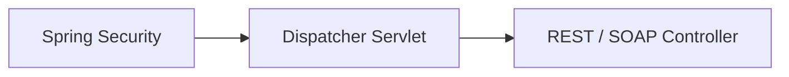
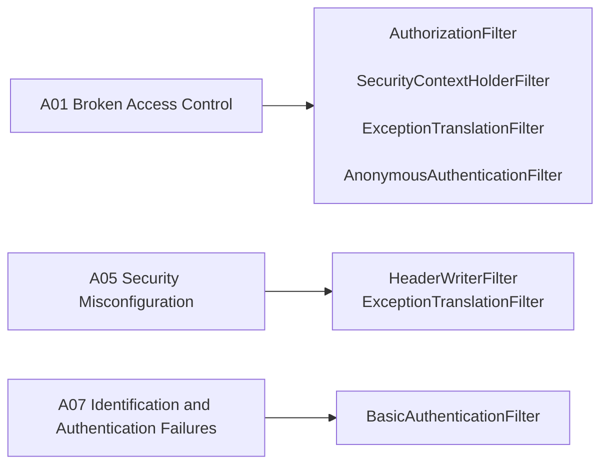

# Application Security Overview

> **Scope note:** like [`implementation-roadmap.md`](implementation-roadmap.md), this file separates what is **verified against the current codebase** (Section 1) from what is **planned** (Section 2). Don't move an item from Section 2 to Section 1 without checking the actual source first.

This application uses Spring Security as the core framework for authentication, authorization, and request protection. The OWASP Top 10 (a regularly-updated industry report on the most critical web application security risks) is used as the reference framework for prioritizing and categorizing security work below.

### OWASP Top 10 Reference
A01 Broken Access Control · A02 Cryptographic Failures · A03 Injection · A04 Insecure Design · A05 Security Misconfiguration · A06 Vulnerable and Outdated Components · A07 Identification and Authentication Failures · A08 Software and Data Integrity Failures · A09 Security Logging and Monitoring Failures · A10 Server-Side Request Forgery (SSRF)

---

## Section 1: Already Implemented

### 1a. Application Security

- **CORS lockdown** — only `http://localhost:5173` is allowed as an origin, explicit method/header allow-list. *(A05)*
- **Default security headers** — `HeaderWriterFilter` is active (not disabled), so Spring's baseline response headers (e.g. `X-Content-Type-Options`, `X-Frame-Options`) are applied. *(A05)*
- **No SSRF surface** — neither the REST nor SOAP controllers make outbound HTTP calls; there is no attacker-controllable URL/host/path for the server to call. *(A10)*
- **Test isolation** — `TestSecurityConfig` (`@Profile("test")`) permits all requests, keeping security concerns out of unrelated unit/integration tests.

#### Authentication

- **HTTP Basic auth** via Spring Security (`SecurityConfig.java`), single in-memory user (`admin`/`admin`, role `ADMIN`). *(A07)*
- **Password hashing** — `BCryptPasswordEncoder` for the stored admin password. *(A02, partial — see 2a for the rest)*

#### Authorization

- **URL-based access rule** — `/api/rest/**` requires authentication; all other requests permitted. Enforced via `AuthorizationFilter`. *(A01)*

**Active filter chain (verified against `SecurityConfig`/`TestSecurityConfig`, not the Spring Security default set):**

> Note: `CsrfFilter` is intentionally absent — both configs call `.csrf(AbstractHttpConfigurer::disable)`, which omits the filter rather than adding a no-op. `UsernamePasswordAuthenticationFilter` and the `DefaultLoginPage/LogoutPageGeneratingFilter`s are also absent — they're only added by `formLogin()`, which this app doesn't use (Basic auth only).

### 1b. DevSecOps

- **CI-only artifact provenance** — JAR and Docker images are built exclusively inside GitHub Actions; nothing locally-built is ever published. *(A08)*
- **Trusted dependency sources** — Maven Central / npm registry only, no unvetted repositories. *(A08)*
- **Secrets kept out of source control** — Postgres credentials are injected via `.env` (gitignored) locally and GitHub Actions `environment: ci` secrets in CI; never hardcoded in `application*.properties` (uses `${POSTGRES_PASSWORD}` placeholders).
- **Fail-fast pipeline** — unit tests gate the frontend build, Docker build/push, and integration test stages; a failure upstream stops the rest of the pipeline.

### 1c. Cybersecurity

- **OWASP Top 10 as risk framework** — used to categorize and prioritize security work across this document, giving a consistent reference vocabulary instead of ad-hoc judgment calls. Risks currently mitigated: A01 (URL-based access rule), A02 (password hashing), A05 (CORS + default headers), A07 (Basic auth), A08 (CI-only artifact builds), A10 (no outbound calls).

> Most organizational/operational cybersecurity practices (SOC, incident response, compliance audits, threat intelligence) don't apply to a single-developer portfolio project — there's no organization to operate. The closest applicable practices are covered under 1a/1b above and their planned counterparts in 2c.

---

## Section 2: To Be Implemented

### 2a. Application Security

- **HTTPS / TLS** — no SSL config exists anywhere; the app currently only serves plain HTTP. Add TLS termination + HSTS header. *(A02)*
- **Rate limiting** — no throttling on auth or write endpoints. *(A04, A07)*
- **Centralized exception handling** — already tracked in `implementation-roadmap.md`; upgrading the `exceptions` package to `@RestControllerAdvice`/`ProblemDetail` also reduces accidental stack-trace leakage. *(A05)*

#### Authentication

- **Remove the hardcoded admin credential** — `admin`/`admin` is hardcoded directly in `SecurityConfig.java` (tracked in git). Externalize via env var or a seeded, non-default account. *(A02 — this is the actual gap in "no hardcoded secrets," not yet true)*
- **OAuth 2.0 authentication flow** — no OAuth2 dependency or config exists yet. *(A07)*
- **Multi-Factor Authentication (MFA)** — not implemented; would layer on top of OAuth2 or the existing Basic auth. *(A07)*
- **Session hardening** — no `SessionCreationPolicy` or session-fixation/cookie config exists; needed if the app moves beyond stateless Basic auth. *(A07)*

#### Authorization

- **Method-level authorization (`@PreAuthorize`)** — only one role (`ADMIN`) exists today with a single URL-pattern rule; once multiple roles exist, enforce them at the method level, not just the URL matcher. *(A01)*

### 2b. DevSecOps

- **Dependency vulnerability scanning** — no Dependabot or Trivy/grype step exists in CI yet, despite `security-events: write` already being declared in `github-actions.yml`. *(A06)*
- **Static analysis / SAST (SonarQube or SonarCloud)** — no static analysis gate exists in the pipeline yet. *(A06, A03 — catches injection-prone patterns SQL/JPA-side, not via a Spring Security filter)*
- **Secret scanning in CI** (e.g. gitleaks) — nothing currently scans commits for accidentally-committed secrets.
- **SBOM generation** for built images — not currently produced.

### 2c. Cybersecurity

- **Centralized log aggregation + alerting** — no ELK (or equivalent) log shipping exists yet, and no alerting on repeated 401/403 responses. This was previously stated in this document as already implemented — it isn't; it now lives here until built. *(A09)*
- **Basic threat-modeling notes / incident-response runbook** — optional given the solo-project scope, but worth a short doc once the app has real users or real data.
