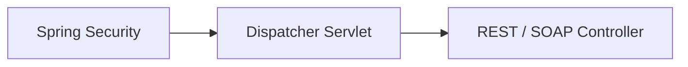
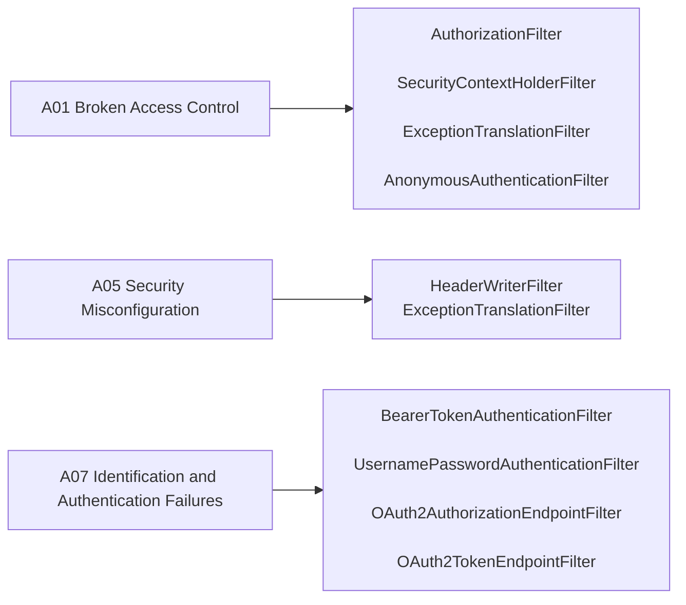

# Application Security Overview

> **Scope note:** like [`implementation-roadmap.md`](implementation-roadmap.md), this file separates what is **verified against the current codebase** (Section 1) from what is **planned** (Section 2). Don't move an item from Section 2 to Section 1 without checking the actual source first.

This application uses Spring Security as the core framework for authentication, authorization, and request protection. The OWASP Top 10 (a regularly-updated industry report on the most critical web application security risks) is used as the reference framework for prioritizing and categorizing security work below.

### OWASP Top 10 Reference
A01 Broken Access Control · A02 Cryptographic Failures · A03 Injection · A04 Insecure Design · A05 Security Misconfiguration · A06 Vulnerable and Outdated Components · A07 Identification and Authentication Failures · A08 Software and Data Integrity Failures · A09 Security Logging and Monitoring Failures · A10 Server-Side Request Forgery (SSRF)

---

## Section 1: Already Implemented

### 1a. Application Security

- **CORS lockdown** — only `http://localhost:5173` is allowed as an origin, explicit method/header allow-list. *(A05)*
- **Default security headers** — `HeaderWriterFilter` is active (not disabled), so Spring's baseline response headers (e.g. `X-Content-Type-Options`, `X-Frame-Options`) are applied. *(A05)*
- **No SSRF surface** — neither the REST nor SOAP controllers make outbound HTTP calls; there is no attacker-controllable URL/host/path for the server to call. *(A10)*
- **Test isolation** — `TestSecurityConfig` (`@Profile("test")`) permits all requests, keeping security concerns out of unrelated unit/integration tests.
- **HTTPS / TLS (opt-in)** — `server.ssl.enabled=${SSL_ENABLED:false}` in `application.properties`, backed by a self-signed PKCS12 keystore (`backend/keystore/`, gitignored, password in `.env`). Off by default so local dev/CI keep using plain HTTP unchanged. When enabled: `HttpToHttpsRedirectConfig` adds a second Tomcat connector on `server.http.port` (8080) with a `SecurityConstraint` requiring confidential transport, so Tomcat itself redirects HTTP → HTTPS (the modern replacement for Spring Security's deprecated `requiresChannel()`); `SecurityConfig` explicitly configures HSTS (`includeSubDomains`, 1-year max-age) via `.headers(...)`. Verified: HTTPS responds 200 with `Strict-Transport-Security` header, plain HTTP on 8080 returns a 302 to the HTTPS URL, OAuth2 session cookie's `Secure` flag works correctly over TLS. *(A02)*

#### Authentication

- **DB-backed authentication** — `OmniApiUserDetailsService` (`security/OmniApiUserDetailsService.java`) implements Spring Security's `UserDetailsService`, loading credentials from the `app_user` table via `UserRepository`. The hardcoded `InMemoryUserDetailsManager` is removed. `UserService.saveUser()` BCrypt-hashes passwords before persisting, so credentials stored via the REST API are always hashed. A `UserDataLoader` (`db/UserDataLoader.java`) seeds a default admin user on startup if `app_user` is empty; credentials are configurable via `omniapi.admin.username`/`omniapi.admin.password` (env vars `OMNIAPI_ADMIN_USERNAME`/`OMNIAPI_ADMIN_PASSWORD`, defaulting to `admin`/`admin` for H2/SQLite dev profiles). *(A02, A07)*
- **OAuth 2.0 Authorization Code + PKCE, JWT access tokens** — OmniAPI is its own self-hosted OAuth2 Authorization Server (`spring-security-oauth2-authorization-server`, `security/oauth/AuthorizationServerConfig.java`), not a delegation to an external IdP. A single public client (`omniapi-spa`, `ClientAuthenticationMethod.NONE`, PKCE mandatory, no client secret) is registered in-memory. `/api/rest/**` is a Resource Server (`oauth2ResourceServer().jwt()` in `SecurityConfig`) validating JWTs signed with an RSA keypair generated in-memory at application startup — **documented limitation**: the signing key rotates on every restart, invalidating prior tokens; acceptable given the 15-minute access-token TTL, swap-in point is a persisted key (mirrors the existing `keystore/omniapi.p12` TLS pattern). No refresh tokens: Spring Authorization Server hardcodes a refusal to issue them to public clients (`ClientAuthenticationMethod.NONE`) on the `authorization_code` grant. The React SPA posts credentials to `POST /api/auth/login` (`api/auth/AuthController.java`), which validates via `AuthenticationManager` (backed by `OmniApiUserDetailsService`), establishes a Spring Security session, and returns 200/401 JSON — the browser then navigates to `/oauth2/authorize` with the session cookie already set, so the Spring login page is **never shown to the user**. *(A07)*

#### Authorization

- **URL-based access rule** — `/api/rest/**` requires authentication; all other requests permitted. Enforced via `AuthorizationFilter`. *(A01)*

**Active filter chains (verified against `AuthorizationServerConfig`/`SecurityConfig`/`TestSecurityConfig`, not the Spring Security default set):** there are now two `SecurityFilterChain` beans outside the test profile — `@Order(1)` in `AuthorizationServerConfig` matches only the Authorization Server's own endpoints (`/oauth2/*`, OIDC discovery); `@Order(2)` in `SecurityConfig` is the catch-all that also now serves `/login` and protects `/api/rest/**` as a Resource Server.

> Note: `CsrfFilter` is intentionally absent from both chains — `AuthorizationServerConfig` and `SecurityConfig` both call `.csrf(AbstractHttpConfigurer::disable)`, which omits the filter rather than adding a no-op. `UsernamePasswordAuthenticationFilter` and the `DefaultLoginPageGeneratingFilter` are now legitimately present on the `SecurityConfig` chain (`formLogin()`) — this corrects an earlier version of this doc that described them as absent, which was true before the OAuth2 work landed but is no longer accurate. A consequence worth flagging: a browser holding a valid Spring Security session cookie (from visiting `/login` directly) can also reach `/api/rest/**` without a bearer token, since both authentication mechanisms are active on the same chain — an acceptable overlap for this project's scope, not engineered around with a third chain.

### 1b. DevSecOps

- **CI-only artifact provenance** — JAR and Docker images are built exclusively inside GitHub Actions; nothing locally-built is ever published. *(A08)*
- **Trusted dependency sources** — Maven Central / npm registry only, no unvetted repositories. *(A08)*
- **Secrets kept out of source control** — Postgres credentials are injected via `.env` (gitignored) locally and GitHub Actions `environment: ci` secrets in CI; never hardcoded in `application*.properties` (uses `${POSTGRES_PASSWORD}` placeholders).
- **Fail-fast pipeline** — unit tests gate the frontend build, Docker build/push, and integration test stages; a failure upstream stops the rest of the pipeline.

### 1c. Cybersecurity

- **OWASP Top 10 as risk framework** — used to categorize and prioritize security work across this document, giving a consistent reference vocabulary instead of ad-hoc judgment calls. Risks currently mitigated: A01 (URL-based access rule), A02 (password hashing, opt-in TLS, no hardcoded credentials), A05 (CORS + default headers), A07 (OAuth2 + JWT + DB-backed auth), A08 (CI-only artifact builds), A10 (no outbound calls).

> Most organizational/operational cybersecurity practices (SOC, incident response, compliance audits, threat intelligence) don't apply to a single-developer portfolio project — there's no organization to operate. The closest applicable practices are covered under 1a/1b above and their planned counterparts in 2c.

---

## Section 2: To Be Implemented

### 2a. Application Security

- **Rate limiting** — no throttling on auth or write endpoints. *(A04, A07)*
- **Centralized exception handling** — already tracked in `implementation-roadmap.md`; upgrading the `exceptions` package to `@RestControllerAdvice`/`ProblemDetail` also reduces accidental stack-trace leakage. *(A05)*

#### Authentication

- **Multi-Factor Authentication (MFA)** — not implemented; would layer on top of the existing OAuth2 flow. *(A07)*
- **Session hardening** — `SessionCreationPolicy` and session-fixation protection not explicitly configured; the session introduced by `AuthController`'s `POST /api/auth/login` (used only for the brief OAuth2 authorization step) inherits Spring Boot defaults. *(A07)*

#### Authorization

- **Method-level authorization (`@PreAuthorize`)** — only one role (`ADMIN`) exists today with a single URL-pattern rule; once multiple roles exist, enforce them at the method level, not just the URL matcher. *(A01)*

### 2b. DevSecOps

- **Dependency vulnerability scanning** — no Dependabot or Trivy/grype step exists in CI yet, despite `security-events: write` already being declared in `github-actions.yml`. *(A06)*
- **Static analysis / SAST (SonarQube or SonarCloud)** — no static analysis gate exists in the pipeline yet. *(A06, A03 — catches injection-prone patterns SQL/JPA-side, not via a Spring Security filter)*
- **Secret scanning in CI** (e.g. gitleaks) — nothing currently scans commits for accidentally-committed secrets.
- **SBOM generation** for built images — not currently produced.

### 2c. Cybersecurity

- **Centralized log aggregation + alerting** — no ELK (or equivalent) log shipping exists yet, and no alerting on repeated 401/403 responses. This was previously stated in this document as already implemented — it isn't; it now lives here until built. *(A09)*
- **Basic threat-modeling notes / incident-response runbook** — optional given the solo-project scope, but worth a short doc once the app has real users or real data.
